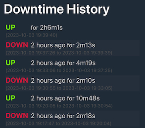

# pinger
Pings a specified address and provides an outage report. Great for running locally to report on the
reliability of your connection.

## Installation

`go install github.com/dannyroes/pinger`

## Usage

`pinger <host> [flags]`

`<host>` The address of the host to run the ping test against

### Flags
`-p --port` The port to serve the downtime report on (default 8080) \
`-o --output` Output the downtime report in json format to the specified file \
`-i --input` Import a downtime report from the specified file \

## Examples

Ping google.com and serve the report on http://localhost:8080 \
`pinger google.com`

Ping 1.1.1.1 and serve the report on http://localhost:2323 \
`pinger 1.1.1.1 -p 2323`

Ping google.com, serve the report on http://localhost:8080 and output to `report.json` \
`pinger google.com -o report.json`